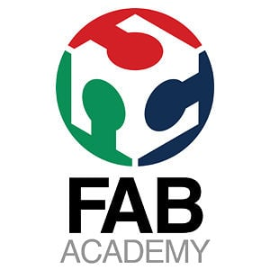
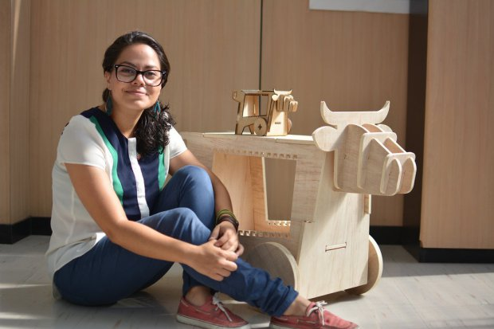
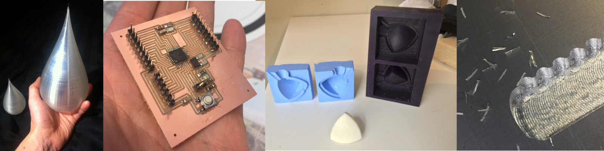

# What is Fab Academy
An awesome 5 month course where you learn how to make almost anything

* [Teaser video for Fab Academy 2015](https://vimeo.com/111864398)
* [Interview with a Fab Academy student who made a home brewing monitor](https://vimeo.com/109169527)
* [Interview with a Fab Academy student who made a synthesizer](https://vimeo.com/109169526)
* 
 
     [Makezine article about "Make something Big Week" of Fab Academy 2015 at Fab Lab Tecsup in Lima-Petru](http://makezine.com/2015/04/30/make-something-big-at-fab-academy/)

# Taking Fab Academy in Oslo 2018
The international course [Fab Academy 2018](http://fabacademy.org/) will be hosted in Oslo at Fab Lab [Fellesverkstedet](http://www.fellesverkstedet.no/) [(github)](https://github.com/fellesverkstedet) from February to end of July next year. 

[Here is link to a presentation about the course in Oslo](https://docs.google.com/presentation/d/1fOQa_VqbehmpVGOxCrXS4RunA4Gwol_Z0BbzzOylldE/edit?usp=sharing)

Ten students will be able to participate in an international intensive course in "how to make almost anything" using digital fabrication techniques such as 3D printing, microelectronics design, production and programming, large scale CNC-milling, laser cutting, moulding and casting, composites and more. Sounds interesting?

Weekly lectures will be held by video conference by professor [Niel Gershenfeld](https://en.wikipedia.org/wiki/Neil_Gershenfeld) who initiated the Fab Lab network as part of an outreach program at Bostons MIT. 
The students will have 24/7 access to equpiment and workshops at Bitraf. Supplies and tutoring are provided by [Fellesvekstedet.](https://www.facebook.com/fellesverkstedet/) 
The local hands on instructor and coordinator for the Oslo group will be [Jakob Nilsson,](http://archive.fabacademy.org/archives/2017/fablabverket/students/100/) who took Fab Academy this year, loved it and is very excited to help make next years students succeed.
The local Mentor will be Jens Dyvik, known for his [fabricateable machines initiative](https://github.com/fellesverkstedet/fabricatable-machines) and his two year round the world trip to many Fab Labs called [Making, Living, Sharing.](https://drive.google.com/drive/folders/0B8t_s65R-GJNT0k1VGt3YkFrbWM) He has vowed to make it possible for the students to do Fab Academy with machines that are fabricated in the lab, thus realising the dream of Fab Labs making Fab Labs.
The remote Mentor will be Ohadino Haad who is Director of Academic Research & Development at [Stratasys](http://www.stratasys.com/) and tirelessly mentored Norways first class of Fab Academy this year.

The course is fast paced with a new concept introduced each week, the work is largely self guided and documentet online for evaluation and sharing with the other students. The course finishes with a final project there each student demonstrate integration of the many skills they have learned on the way. 
The course is highly adaptable to the students existing skill level and the their own ideas. Already skilled makers are able to challange themselves to grow and beginners will have great help from studying the examples provided by their previous and current class mates which number in the hundreds each year. 
It will not be possible to take Fab Academy at the same time as holding up a full time job. The time commitment is about 20 hours a week at minimum, but could be far greater if the student is highly motivated, does not possess the background for a particular unit (or units) or just wants to really throw themselves into the program.

Further reading in the [Fab Academy Course handbook](http://docs.academany.org/FabAcademy-Handbook/_book/basic_fab_academy_course_info.html)

The Fab Academy [tuition fee](http://fabacademy.org/application-form/cost-breakdown-structure/) is comprised by Central Costs and Local Costs. The central Costs are 2500€ and the local costs are 4500€. We are committed to giving the students a world class level Fab Academy experience and the fees are set to make that possible.

Applications for Fab Academy 2018 in Oslo are OPEN!  [APPLY HERE](https://form.jotformeu.com/71832813940356)

DEADLINE FOR APPLICATION SUBMISSIONS IS DECEMBER 25TH 2017

