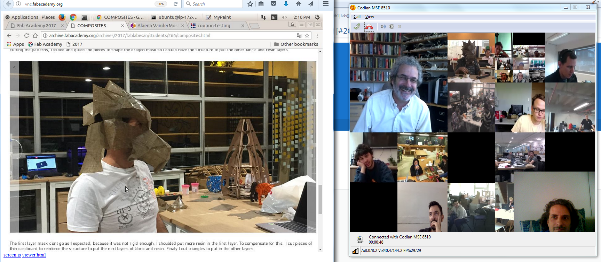

# What is Fab Academy
An awesome 5 month course where you learn how to make almost anything. 

* [Teaser video for Fab Academy 2015](https://vimeo.com/111864398)
* [Interview with a Fab Academy student who made a home brewing monitor](https://vimeo.com/109169527)
* [Interview with a Fab Academy student who made a synthesizer](https://vimeo.com/109169526)
* 
 
     [Makezine article about "Make something Big Week" of Fab Academy 2015 at Fab Lab Tecsup in Lima-Petru](http://makezine.com/2015/04/30/make-something-big-at-fab-academy/)

	
# Taking Fab Academy in Oslo
We are working towards making it possivle to take part in the international course [Fab Academy](http://fabacademy.org/) at the fantastic Fab Lab [Fellesverkstedet](http://www.fellesverkstedet.no/) in Oslo. [(github)](https://github.com/fellesverkstedet) Possibly in collaboration with  [bitraf](https://bitraf.no/) which is Norways biggest makerspace! 

We are aiming for that ten students per year will be able to participate in an international intensive course that lets'you learn how to make almost anything using digital fabrication techniques such as 3D printing, microelectronics design, production and programming, large scale CNC-milling, laser cutting, moulding and casting, composites and more. Sounds interesting?

The course is fast paced with a new concept introduced each week, the work is largely self guided and documentet online for evaluation and sharing with the other students. The course finishes with a final project there each student demonstrate integration of the many skills they have learned on the way. 
The course is highly adaptable to the students existing skill level and the their own ideas. Already skilled makers are able to challange themselves to grow and beginners will have great help from studying the examples provided by their previous and current class mates which number in the hundreds each year. 
It will not be possible to take Fab Academy at the same time as holding up a full time job. The time commitment is about 20 hours a week at minimum, but could be far greater if the student is highly motivated, does not possess the background for a particular unit (or units) or just wants to really throw themselves into the program.

The Fab Academy [tuition fee](http://fabacademy.org/application-form/cost-breakdown-structure/) is comprised by Central Costs and Local Costs. The local costs for coming years are not yet established. 
Further reading in the [Fab Academy Course handbook](http://docs.academany.org/FabAcademy-Handbook/_book/basic_fab_academy_course_info.html)

[Offical press release for the 2018 class](https://github.com/Academany/academany-mkt/blob/master/fabacademy2017/press/press_en.md)

Questions?: Contact Jakob Nilsson on Jakob.A.Nilsson@gmail.com who took Fab Academy in [Fab Lab Verket](https://verketfablab.no/) in Moss 2016 [2016 Student page](http://archive.fabacademy.org/archives/2017/fablabverket/students/100/)

*Students from all over the world follow video conference classes in their local fab labs*
